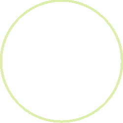

# NOTES


## Styling notes

**This is bold line**

*This is italic line*

~~This is a corrected line~~

**This text is _extremely_ important**

> This text is a quote

This is a `code text`

And the following parragraph is also code:

```
git status
git add
git commit
```
This is a link to [this github account](https://github.com/dmartin-ez)

& here there is a link to [the licence](blob/master/LICENSE).

Now let's add a beautiful circle 

Here, there's a unorded list:
* one
* two
* three
* four

An an orded list:
1. one
2. two
3.three
4. four

A nested list will be next:
* First element
  * second
    * third
      * forth
        * fifth
        
I like task list:
- [ ] This is pending
- [x] This finally was done
- [ ] Another pendding issue

@github/dmartinez-z do you receive this notification?

#1 Is this pull request quoted?

Time for emojis :+1: :exclamation:

Parragrap 2
This is a link withou markup https://github.com

Parragraph 3
```php 
<?php
$helloWorld = 'Hello World';
echo $helloWorld;
?>
```
There's a table below:

Header 1 | Header 2
------------ | -------------
Content cell 1 | Content cell 2
Content cell 3 | Content cell 4
Content `coded` cell  5 | Content cell 6

Did you know you can center the text inside the cells? Like so:

| Left | Center | Right |
| :---         |     :---:      |          ---: |
| right cell   | center cell     | lett cell    |
| git diff     | git diff       | git diff      |

